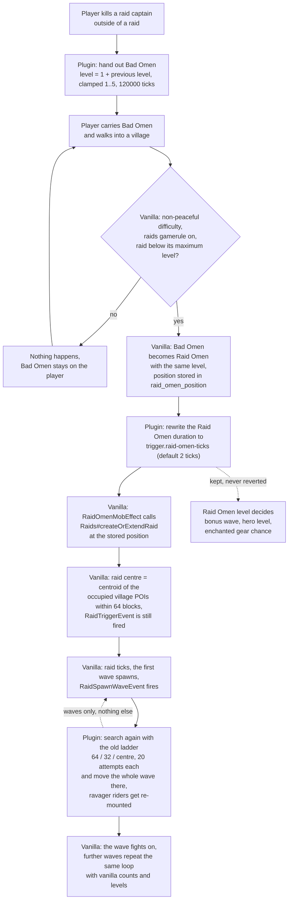

# OldRaidMechanics

A Paper **26.2** plugin that brings the **raid behaviour of Minecraft 1.20.1** back to modern servers.

Raid mechanics changed twice in a row and broke the old raid farm designs:

* **1.21** (`24w13a`): killing a raid captain no longer hands out Bad Omen — you have to drink an
  Ominous Bottle.
* **1.21.2** (`24w33a`, `24w35a`): a Bad Omen in a village only becomes a Raid Omen with a 30 second
  countdown, the spawn ranges became countdown driven instead of attempt driven, and a raid does not
  start at all if the raiders cannot find a spawn position within 96 blocks vertically of the village
  centre.

This plugin restores the 1.20.1 behaviour for those three points and leaves everything else — wave
counts, raider counts, enchanted gear, raid win/loss and celebration flow — exactly as vanilla has it.

- Java 25, built against `io.papermc.paper:paper-api:26.2.build.124-stable`
- Server side only, single jar, no dependencies
- English comments, config driven, `/oldraid reload|status`

---

## 1. What it changes

| Piece | Vanilla 1.21.2+ | With this plugin |
| --- | --- | --- |
| Bad Omen in a village | Bad Omen turns into Raid Omen (same level), the raid starts **30 seconds** later at the position where the conversion happened | the conversion and its level are kept, only the countdown is spent in the background: `trigger.raid-omen-ticks` shortens the Raid Omen, so vanilla's own `RaidOmenMobEffect` starts the raid on the next tick |
| Raid captain killed | drops an Ominous Bottle, no Bad Omen | the player gets Bad Omen directly, with the pre-1.21 stacking (level = 1 + previous level, clamped to 1..5, 120000 ticks = 100 minutes) |
| Wave spawn position | shrinking radius search (`howFar = 0.22 * secondsRemaining - 0.24`), plus "no spawn position within 96 blocks vertically of the village centre ⇒ the raid never starts" | pre-1.21.2 search: a three step range ladder (64 / 32 / centre), 20 attempts each, fresh random angle per attempt, surface height, position outside the village except in the last step |

Raid **triggering** is deliberately left to vanilla — the plugin never calls
`Raids#createOrExtendRaid` itself. That keeps the vanilla raid centre, Paper's `RaidTriggerEvent`
and, most importantly, the **Raid Omen level** (which decides the bonus wave, the hero of the village
level and the raiders' enchanted gear). The plugin only rewrites the duration of the Raid Omen effect
so the 30 second countdown is not something you have to wait for.

### Flow



Every step marked `Plugin:` is the plugin; everything else is untouched vanilla code. The two dotted
edges show what the plugin deliberately leaves alone.

---

## 2. Mechanics reference

Everything below is vanilla behaviour that this plugin interacts with. The numbers are here because
they are easy to get wrong when you are testing a raid farm — they come from the decompiled
Paper 26.2 server and from the wiki (sources in section 9).

### 2.1 Raid waves

* Total waves come from the **difficulty only**: easy 3, normal 5, hard 7.
* A **Raid Omen level greater than I adds exactly one bonus wave** — not one wave per level, not
  several. `Raid.hasBonusWave()` is literally `raidOmenLevel > 1`, and
  `Raid.hasSpawnedBonusWave()` is `groupsSpawned > numGroups`, so the bonus wave can only appear once.
  So: hard + omen level V = 7 + 1 = **8 waves**.
* The bonus wave uses the same raider counts as the last regular wave.
* Between waves the raid runs a **300 tick (15 s) countdown**. In 26.2 `raidCooldownTicks` is only
  ever set to 300 and then decremented — there is no "the wave left the raid, skip the wait" branch.
  The next wave spawns as soon as `shouldSpawnGroup()` is true: countdown at 0, no raider of the
  current wave alive, and either more waves are left or the bonus group applies.
* The Raid Omen level also sets the chance for raiders to carry enchanted gear:
  I 0 %, II 10 %, III 25 %, IV 50 %, V 75 %.
* Hero of the Village: **48000 ticks (40 minutes)** for every level, but its *amplifier* is
  `raidOmenLevel - 1`, i.e. the reward follows the level, not the duration.

### 2.2 Bad Omen

* Since 1.21 (24w13a) the **only** source is the Ominous Bottle: 1:40:00 (120000 ticks), no particles.
  Killing a raid captain no longer gives it.
* Ominous Bottles drop at levels I–V with equal probability, and only from a captain that is
  **not part of an active raid**. The ominous banner always drops.
* Conversion to Raid Omen happens when a player with Bad Omen is in a village, on non-peaceful
  difficulty, in creative/survival/adventure (spectator is excluded), the `raids` game rule is on and
  there is no raid or the raid is below its maximum omen level.
* Bad Omen is **consumed** by that conversion — the level does not stay on the player.

### 2.3 Raid Omen

* Vanilla duration 600 ticks (30 s), same level as the Bad Omen that produced it.
* The position is saved in the player's `raid_omen_position`; when the effect expires, the raid is
  created there. The raid centre is the centroid of the occupied village POIs (tag `village`) within
  64 blocks, or that position itself if there are none. A raid within 96 blocks is extended instead.
* This plugin keeps all of that and only changes the duration (default 2 ticks). Do not set
  `raid-omen-ticks` below 2: `RaidOmenMobEffect` triggers on the **last remaining tick**
  (`remainingDuration == 1`), so a 1 tick effect expires before it can fire.

### 2.4 Trial Omen (trial chambers — not touched by this plugin, but easy to confuse)

The trial chamber uses a separate effect and a separate code path (`TrialSpawnerStateData`):

```java
// TrialSpawnerStateData#transformBadOmenIntoTrialOmen
int amplifier = badOmen.getAmplifier() + 1;   // Bad Omen level 1..5
int duration  = 18000 * amplifier;            // 18000 ticks = 15 minutes per level
player.addEffect(new MobEffectInstance(MobEffects.TRIAL_OMEN, duration, 0));
```

* Duration = **15 minutes × Bad Omen level**, no cap:

  | Bad Omen level | Trial Omen duration | ticks |
  | --- | --- | --- |
  | I | 15 min | 18000 |
  | II | 30 min | 36000 |
  | III | 45 min | 54000 |
  | IV | 60 min | 72000 |
  | V | 75 min | 90000 |

* The Trial Omen effect itself is **always level I** (`amplifier 0`); only the duration scales, and
  the ominous trial spawner does not read any level — it only checks whether a player in survival or
  adventure mode has the effect.
* The conversion needs a **non-ominous** trial spawner (it only happens when the spawner becomes
  ominous) and the player must be in survival or adventure mode. If the player is in a village and in
  range of a trial spawner at the same time, only the Raid Omen is applied.
* After handing out rewards a trial spawner goes on a 36000 tick (30 minute) cooldown.

### 2.5 Durations and tick rate (this is the classic "my effect expired too early" trap)

Every duration above is measured in **game ticks**. `/tick rate N` changes how fast those ticks run,
so it changes the real-time duration without changing the number in the HUD:

| Effect / phase | ticks | game time (20 tps) | real time at 50 tps |
| --- | --- | --- | --- |
| Raid Omen (vanilla) | 600 | 30 s | 12 s |
| Raid wave cooldown | 300 | 15 s | 6 s |
| Bad Omen (bottle / captain) | 120000 | 100 min | 40 min |
| Hero of the Village | 48000 | 40 min | 16 min |
| Trial Omen I / II / III / IV / V | 18000 / 36000 / 54000 / 72000 / 90000 | 15 / 30 / 45 / 60 / 75 min | 6 / 12 / 18 / 24 / 30 min |
| Trial spawner cooldown | 36000 | 30 min | 12 min |

To read the truth instead of eyeballing a HUD timer:

```text
/data get entity <player> active_effects
```

`amplifier` is 0-based (`amplifier: 4b` = level V) and `duration` is the remaining ticks — a trial
omen that reports `duration: 85873` cannot have started at 36000 (30 min), it started at 90000 (75 min).

---

## 3. Install

1. Build: `bash build.sh` → `target/OldRaidMechanics-1.0.0.jar`
   (`build.sh` calls `mvn.sh`, which expects Maven in `C:\tools\apache-maven-3.9.11`; override with
   `MAVEN_HOME_DIR=/c/path/to/maven`. A JDK 25 is required.)
2. Drop the jar into `plugins/` of a **Paper 26.2** server.
3. Edit `plugins/OldRaidMechanics/config.yml`, then `/oldraid reload`.

## 4. Commands and permissions

| Command | Description |
| --- | --- |
| `/oldraid reload` | re-reads `config.yml` and `messages.yml` |
| `/oldraid status` | enabled features, NMS bridge state, current spawn settings and the build stamp baked into the jar (so you can tell which build the server actually loaded) |

Permission `oldraid.admin` (default: op). No aliases, no in-game toggles: the config file is the
source of truth.

## 5. Configuration

```yaml
enabled: true              # master switch

features:
  bad-omen-triggers-raid: true        # shorten the Raid Omen countdown (see 2.3)
  captain-gives-bad-omen: true        # captain hands out Bad Omen directly (pre-1.21 behaviour)
  remove-ominous-bottle-drop: false   # also strip the Ominous Bottle from the captain's drops
  old-spawn-positions: true           # move each wave to the pre-1.21.2 spawn position

trigger:
  raid-omen-ticks: 2        # tick duration used for the Raid Omen effect, min 2, max 600

spawn:
  radius-factor: 2          # highest range of the old ladder (2 = ~64 blocks, 1 = ~32, 0 = centre)
  teleport-delay-ticks: 1   # wait one tick before moving a wave, so vanilla finishes spawning it

debug: false                # log raid triggers, per wave range hits and wave moves
```

---

## 6. Implementation notes

* **Triggering**: `EntityPotionEffectEvent` (ADDED, `RAID_OMEN`) → next tick the effect is replaced
  with the same level at `trigger.raid-omen-ticks`. Vanilla's `RaidOmenMobEffect` then calls
  `Raids#createOrExtendRaid` at the saved `raid_omen_position`. No internals are called for this.
* **Captain**: `EntityDeathEvent` for a `Raider` that `isPatrolLeader()`, is not in a raid and has no
  raid at its position. The killer is `LivingEntity#getKiller()`, or the owner of the tamed wolf that
  dealt the last hit (tracked from `EntityDamageByEntityEvent`).
* **Wave placement**: `RaidSpawnWaveEvent` fires once per wave (`Raid.spawnGroup` clears the cached
  `waveSpawnPos` and then fires it), so the position is recomputed **per wave**, not per raid. The
  whole wave lands in one block, exactly like the pre-1.21.2 code that spawned a group at a single
  position, and ravager + riding pillager pairs are re-mounted after the move because teleporting an
  entity dismounts its passengers.
* **Old range ladder**: `factor = 2 → 1 → 0`, 20 attempts each, fresh random angle per attempt,
  `x = centre.x + floor(cos(a) * 32 * factor + rand(5))`, `z` the same, `y` =
  `World#getHighestBlockYAt(WORLD_SURFACE) + 1` (the NMS heightmap value is one above Bukkit's
  highest block), position must be inside a loaded 21×21 block box, must pass an approximation of the
  ravager `ON_GROUND` check and — for factor 2 and 1 — must not be inside the village.
* **Reflection**: only two read-only lookups on the Mojang-mapped classes are used —
  `ServerLevel#isVillage(BlockPos)` (which is `isCloseToVillage(pos, 1)`, the village test of the old
  spawn search) and `ServerLevel#getRaidAt(BlockPos)` (which is `Raids#getNearbyRaid(pos, 9216)`, i.e.
  96², used by the captain rule). `/oldraid status` reports the NMS bridge state; if a future Paper
  build renames a member, only the affected feature stops working.

## 7. Limits (read before testing a farm)

* Vanilla still decides **whether** a wave spawns at all; if its own search finds nothing the wave
  fails and this plugin cannot help. The plugin re-places a wave after it spawned, it does not inject
  a position into the vanilla search.
* The 1.21.2+ "spawn position within 96 blocks vertically of the village centre" rule still applies to
  vanilla's own search, so a platform far above the village still needs the raid centre to be moved up
  (the usual workstation/POI trick).
* `remove-ominous-bottle-drop` defaults to `false`: the Ominous Bottle drop is vanilla, and by default
  the plugin only changes the raid mechanics themselves.
* Only patrol leaders that are not inside an active raid hand out Bad Omen. The additional check
  "the captain is actually wearing the ominous banner" is not reproduced — the plain
  `Raider#isPatrolLeader()` flag is used.
* The plugin does not touch wave counts, raider counts, enchantment probabilities, the witch loot
  table or the raid cancellation/celebration flow.

## 8. Verified

* Builds with Maven against `paper-api:26.2.build.124-stable` (JDK 25).
* Loads, enables and registers `/oldraid` on a real **Paper 26.2 build 124** server
  (`Enabled - features: bad-omen-triggers-raid, captain-gives-bad-omen, old-spawn-positions`).
* In-game behaviour of a real raid farm (drop rates, farm throughput) is **not** verified here; that
  is what a test session is for.

Live test on that server, with the plugin's debug output enabled:

```text
Captain killed by Tagin_T -> Bad Omen 1
Captain killed by Tagin_T -> Bad Omen 2
Captain killed by Tagin_T -> Bad Omen 3
Captain killed by Tagin_T -> Bad Omen 4
Captain killed by Tagin_T -> Bad Omen 5
Raid Omen countdown cut to 2 tick(s) for Tagin_T (level 5)
Old spawn range factor 2 hit after 1 attempt(s) -> -1497 66 -2600
Moved 7 raiders (of 7 in the wave) to -1497 66 -2600
later waves: 8, 9, 12, 13, 15, 16, 17, 18 raiders
```

That shows the three features in one run: Bad Omen stacks up to level 5, the Bad Omen to Raid Omen
conversion keeps that level, and every wave is moved to the position the old search picked while the
wave counts stay vanilla.

`data get entity Tagin_T active_effects` after that run showed `hero_of_the_village, amplifier: 4b`
(level V raid in hard difficulty) and `trial_omen, duration: 85873` (the level V trial omen, i.e. the
90000 tick tier).

## 9. Sources

* Decompiled Paper 26.2 (build 124) classes this port is modelled on:
  `net.minecraft.world.effect.BadOmenMobEffect`, `net.minecraft.world.effect.RaidOmenMobEffect`,
  `net.minecraft.world.entity.raid.Raid`, `...raid.Raider`, `...raid.Raids`,
  `net.minecraft.world.level.block.entity.trialspawner.TrialSpawnerStateData`,
  `net.minecraft.server.level.ServerLevel`.
  The old spawn search is a port of the 1.21.1 `Raid#findRandomSpawnPos` /
  `Raid#getRavagerSpawnLocation` behaviour (three ranges of 20 attempts, random angle per attempt).
* Wiki: `zh.minecraft.wiki` (the Chinese wiki mirrors the English one and is the one reachable from
  this machine) — the pages Raid, Bad Omen, Raid Omen, Trial Omen, Ominous Trial Spawner, Raid Captain
  and the Java 1.21.2 changelog entries `24w13a` (captains no longer give Bad Omen), `24w33a` (raid
  start attempts / ranges), `24w35a` ("no spawn position within 96 blocks vertically ⇒ the raid does
  not start").
